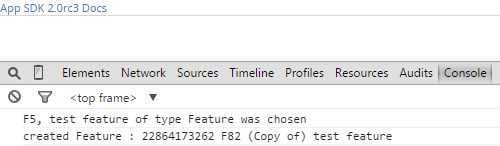

Create PI from other PI data
=========================

## Overview
This app example is a proof of concept of how to create a PortfolioItem from an existing PortfolioItem.
Per WS API documentation, PortfolioItem is a non-creatable type. To allow a flexibility of choosing any existing PI type, e.g. feature, initiative, or theme, the type is set dynamically in the app.

This app is vailable AS IS. It is NOT supported by Rally.
## License

AppTemplate is released under the MIT license.  See the file [LICENSE](./LICENSE) for the full text.

##Documentation for SDK

You can find the documentation on our help [site.](https://help.rallydev.com/apps/2.0rc3/doc/)
